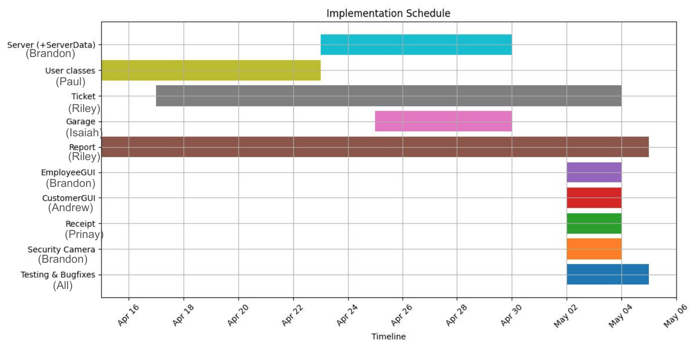

# Parking Garage System: Design Document
**Contributors:** Brandon P., Isaiah W., Andrew L., Prinay S., Paul M., and Riley G.
## Table of Contents
- [**Overview**](#overview)
- [**Context**](#context)
- [**Goals & Non-goals**](#goals--non-goals)
    - [**Goals**](#goals)
    - [**Non-goals**](#non-goals)
- [**Implementation Details**](#implementation-details)
    - [**User Class**](#user-class)
    - [**UserType Enum**](#usertype-enum)
    - [**Customer Class**](#customer-class)
    - [**Employee Class**](#employee-class)
    - [**Ticket Class**](#ticket-class)
    - [**Garage Class**](#garage-class)
    - [**Receipt Class**](#receipt-class)
    - [**Report Class**](#report-class)
    - [**Earning Class**](#earning-class)
    - [**Message Class**](#message-class)
    - [**MessageType Enum**](#messagetype-enum)
    - [**ImageMessage Class**](#imagemessage-class)
    - [**Server Class**](#server-class)
    - [**ServerData Class**](#serverdata-class)
    - [**ClientHandler Class**](#clienthandler-class)
    - [**GateHandler Class**](#gatehandler-class)
    - [**CustomerGUI Class**](#customergui-class)
    - [**EmployeeGUI Class**](#employeegui-class)
        - [**Login Screen**](#login-screen)
        - [**Dashboard Screen**](#dashboard-screen)
    - [**Gate Class**](#gate-class)
    - [**SecurityCamera Class**](#securitycamera-class)
- [**Command Protocols**](#command-protocols)
    - [**Customer Commands**](#customer-commands)
    - [**Employee Commands**](#employee-commands-inherits-customer-commands)
- [**Design Diagrams**](#design-diagrams)
    - [**Server Class Diagram**](#server-class-diagram)
	- [**Client Class Diagram**](#client-class-diagram)
    - [**Sequence Diagram**](#sequence-diagram)
    - [**Use Case Diagram**](#use-case-diagram)
- [**Final Implementation Timeline**](#final-implementation-timeline)
## Overview
This design document aims to eliminate any ambiguity surrounding the implementation of a simulated Parking Garage System (PGS). It reiterates the original problem description, outlines the system's goals and non-goals based on the requirements and scope defined in the [Software Requirements Specification (SRS) document](SRS.md), and provides a clear breakdown of how each class and module should be implemented in Java. To support this, the document includes detailed design diagrams for visual reference and a project timeline with milestones to ensure a smooth and organized implementation cycle.
## Context
We are developing a graphical parking garage management system in Java that enables employees to monitor garage metrics, such as the current vehicle count, generate usage reports, and print tickets and receipts for customers. Customers also have the option to self-park via a separate graphical user interface (GUI) integrated into the system.

The system allows employees to configure fixed rate fees (by the hour) for individual garages and manually override a customer's final fee for when they are exiting the garage. Each customer's ticket is represented by the vehicle they park in the garage. Employees access their interface by logging in with a valid username and password.

The system handles network communication between the user (customers and employees alike) and their garage via TCP/IP through a threaded server capable of handling multiple client connections simultaneously.

## Goals & Non-goals
### Goals
Upon successful implementation of the Parking Garage System (PGS), the following goals will be achieved:
- **Employees** will be able to:
    - Log in to their GUI dashboard using their credentials (username and password).
    - View real-time statistics and activity logs for their assigned garage.
    - Generate usage reports detailing metrics such as revenue earned, vehicle count, and peak usage times.
    - Manage garage settings including adjusting the garage's hourly rate fee.
    - Print parking tickets and payment receipts for customers.
    - Open and close the parking garage gate.
    - Access the garage's security cameras.
    - Change their account password.
	- Manually override a customer's final parking fee when necessary.
- **Customers** will be able to:
    - Self-park using a user-friendly graphical interface.
    - View the current availability of parking spaces in their selected garage.
    - Receive a unique ticket upon entry and make a payment upon exit.
    - Obtain a printed receipt after completing their payment.
- **All users** will be able to interact with the system in a clear and efficient manner:
    - The system will display relevant error messages to guide users when issues occur.
    - It will handle errors gracefully to minimize user disruption.
    - It will support concurrent interactions through multithreading, allowing multiple users to use the system simultaneously without delay.
### Non-goals
- The system will not use encryption to secure transmitted messages over the network as encryption is explicitly prohibited by the project constraints.
- The system will not hash or encrypt user credentials; all credentials will be stored in plaintext.
- The system will not use standard data serialization formats like JSON or XML. Instead, a custom, human-readable format will be implemented for saving data to file.
- The system will not use any third-party databases, libraries, or frameworks. Only Java's built-in standard libraries will be used and all core functionality must be implemented from scratch by us (the development team).
## Implementation Details
### User Class
- Serves as the base class for both `Customer` and `Employee`, providing common attributes and methods used in both of those classes
- Defines common attributes such as the user's associated `Garage` and their `userType`
- All attributes and methods in this class are marked as `protected` as they are meant to be used in the child classes
- Upon instantiation, the `User` class sets its `userType` to `UserType.Undefined`; this value is later updated by the subclass (`Customer` or `Employee`)
- The `userType` is used by the `Server` to determine which kind of user is currently interacting with the system
- Has a method to assign a garage to the user
- Has a method to get the associated garage
- Has a method to get the user type
### UserType Enum
- `Customer`
- `Employee`
- `Undefined`: Default value before the user role is specified
### Customer Class
- Not to be confused with the `CustomerGUI`, this class is server side and does not handle input directly
- `Customer` serves to encapsulate all feasible customer actions, such as parking, paying, and checking space availability
- The `Server` calls `Customer` methods, and returns the result to the `CustomerGUI` as a `Message` object over the network
	- All `Message` handling is done by the `Server`
- Inherits from the `User` class and, thus, becomes associated with a specific `Garage` upon initialization
- Customers do not have a unique user ID
- Has a method to request a new ticket, which returns the ticket's string ID if the garage has space available
- Provides a method to check the number of available spaces in the customer's assigned garage (returns an integer)
- Handles the payment process for the customer when exiting the garage, validating the ticket and updating its status and fee if appropriate
- Includes a method to generate a `Receipt` once a ticket is paid, which is returned to the `CustomerGUI` as a `Message`
### Employee Class
- Represents an employee's actions on the server side, separate from the `EmployeeGUI` which sends commands over the network via `Message` packets
- `Employee` serves to encapsulate all feasible employee actions
- `Server` calls `Employee` methods and returns the result to the `EmployeeGUI` as a `Message` object over the network
	- All `Message` handling is done by the server
- Has attributes to authenticate logins (`username` and `password`)
	- `Server` seaches through a list of `Employees` for matching username and password 
- Each employee has a unique string ID (e.g., "EM0", "EM1") generated on initialization
- Inherits from the `User` class and, thus, becomes associated with a specific `Garage` upon initialization
- Provides a method to override a ticket's fee, based on a given ticket ID and new fee amount
- Includes a method to generate a new ticket for a customer; returns the ticket ID if successful (fails if the garage is full)
- Provides a method to generate and return a `Receipt` for a paid ticket, which is formatted into a `Message` for the `EmployeeGUI`
- Supports generating a usage report (`Report`) for the employee's assigned garage, including:
    - Total revenue earned across time intervals (hour/day/week/month/year)
    - Peak revenue hours
    - Currently parked vehicles (active tickets)
- Has a method to modify the associated garage's hourly rate
### Ticket Class
- Represents both the customer's physical parking ticket and their currently-parked vehicle in the garage
- Is associated with a garage upon creation
- A ticket is created when a customer successfully parks their vehicle, either through self-parking or when an employee provides a ticket
- Tickets are not created if their associated garage is full
- Upon creation, `entryTime` is set to the current time
- When the customer is checking out, `exitTime` is set to the current time
- The system calculates the parking fee by multiplying the garage's fixed hourly rate by the total parking duration (`exitTime - entryTime`)
- A paid parking ticket's status is recognized in the `isPaid` boolean
- Each ticket has a unique string ID (e.g., "TI0", "TI1") generated on initialization
- Tickets can be searched by ID within a garage's record, useful for:
    - Returning customers attempting to leave
    - Employees needing to look up and manage specific tickets
### Garage Class
- Represents a physical parking garage in the system
- Aggregates all tickets associated with the garage (vehicles currently parked)
	- Each `Garage` maintains two `Ticket` lists: one for all tickets ever created, and one for tickets not yet paid off (customers still in garage)
	- Separate list are useful for `Report` and for paying off tickets
- Aggregates all `SecurityCameras` associated with the garage
- Owns only one parking garage gate (`Gate`)
- A new ticket cannot be created if the garage is full (e.g., the number of active tickets equals the garage's capacity)
- The garage can report its number of available spaces using the formula: `capacity - ticketList.size()`
- Provides a method to check if the garage is currently full, returning a boolean value of the condition `capacity == ticketList.size()`
- Each garage has a unique string ID (e.g., "GA0", "GA1") generated at creation
- Garage instances are initialized with a capacity, hourly rate, and garage name (separate from their ID)
- Has a method to add a new security camera to the garage (through aggregation)
- Security cameras can also be removed from the garage based on their string ID
- A garage's name can be renamed after initialization
- Stores a configurable hourly parking rate, which can be updated by an employee
- Tracks total revenue earned by the garage across all paid tickets
- When a new ticket is generated (and space is available), it is added to the garage's ticket list
- When a ticket is paid:
    - It gets removed from the garage's ticket list
    - The time and amount are recored in `Report`
- Garage keeps track of its total revenue earned over the last hour, day, week, month, and year via `Report`
- Garage stores its peak hour of usage (based on the highest revenue earned during any given hour)
### Receipt Class
- Represents a summary of a completed parking transaction, generated after a ticket is fully paid
- The receipt includes the following attributes:
    - The ticket ID
    - The garage name
    - The entry timestamp
    - The exit timestamp
    - The payment amount (final fee charged to the customer)
- The `Server` creates a `Receipt` object using information from the paid ticket, then formats it into a string using the `toString()` method
- This string is sent to the appropriate GUI (`CustomerGUI` or `EmployeeGUI`) via a `Message` object over the network
- The GUI parses the message payload back into a `Receipt` object (or simply displays the formatted string, depending on implementation)
- The `Receipt` class is strictly a data container, it does not perform any calculations or network communication
- The class constructor has all of the class attributes as its arguments to ensure it can be reconstructed reliably from the server's message payload
### Report Class
- Used by the `Server` to provide a summary of garage performance
- Tracks total revenue across different time frames (from the last hour, day, week, year, lifetime, etc.) by iterating through an ArrayList of `Earning` objects and checking their dates.
- Report class creates a new `Earning` object containing the exit date and payment amount after a ticket payment has been successful. It then stores it in the list of Earnings.
- Report class stores every vehicle entry date of the garage in an ArrayList (`entryDates`)
- Has attribute for number of cars currently in the garage
	- Is incremented when a ticket is created, and decremented when a ticket is paid off
- Includes a `toString()` method used by the `Server` to format the report into a string `Message` payload
	- `toString()` has parameters for the earliest and latest time generated on the report, so employees can peer into a limited window of the report
- The `EmployeeGUI` directly displays the formatted string
### Earning Class
- Represents a record of a completed parking transaction within a garage.
- Each `Earning` object stores:
	- The exit time (`Date`) when the vehicle left the garage.
	- The payment amount (`double`) collected at that time.
- Earning objects are created and managed by the `Report` class to keep track of all revenue over time.
- Serves as the basis for calculating:
	- Revenue earned per hour
	- Revenue earned today
	- Revenue earned this week, month, and year
	- Total lifetime revenue
- The `Earning` class is strictly a data container:
	- It does not perform any calculations on its own.
	- It provides `getDate()` and `getRevenue()` methods for retrieving its fields.
	- It includes a `toString()` method for the server to save its data to file.
- Helps the `Report` class maintain granular, time-based revenue analytics without directly modifying ticket data.
### Message Class
- Enables communication between the `Server` and GUI clients (`CustomerGUI` and `EmployeeGUI`)
- Contains a type attribute (from the `MessageType` enum) that indicates the purpose of the message
- Contains attribute for sender `from` which is specified by the `UserType` above
- The message type helps both the `Server` and the GUI determine how to interpret and respond to the message (e.g., display a success confirmation or error prompt)
- Includes a text attribute, which stores command sub-typing, and the actual human-readable message content or payload string (e.g., a receipt, report, or feedback message)
- Common methods include:
    - `getText()`: Returns the message content
    - `getType()`: Returns the message type
    - `getSender()`: Returns the message sender
### MessageType Enum
- `Success`: Indicates that the user's action was successfully completed (e.g., payment processed, ticket generated)
- `Fail`: Indicates that the user's action could not be completed (e.g., garage full, invalid ticket ID)
- `Request`: Requests a specific action from Server (meant for the GUIs)
### ImageMessage Class
- A child class of `Message` used to encapsulate and transmit images between the server and GUI clients
- Specifically designed to deliver security camera feeds in the form of static images (simulated using `ImageIcon`)
- Contains an additional attribute to store an image alongside the standard message text, type, and sender information
- Allows the Employee GUI to request and display visual feeds from the garage's security cameras
- Provides a getter method to retrieve the image payload when the message is received on the client side
### Server Class
- Acts as the central controller of the system, receiving and processing all commands sent by the `CustomerGUI` and `EmployeeGUI`
- Authenticates user input, delegates requests to the appropriate objects (e.g., `Customer`, `Employee`, `Garage`), and returns an appropriate `Message` in response
- Maintains real-time multithreaded communication with all connected clients using individual threads for each socket connection
- Logs all system activity to a persistent file for auditing and troubleshooting purposes
- Can send system log to the `EmployeeGUI`, allowing employees to view internal events on their dashboard
- Handles data persistence by saving all essential objects (Garages, Tickets, and Employees) to file in a custom plaintext format
- Uses each of its objects' `toString()` methods for serialization, and loads data in a specific order to preserve ID consistency and object associations upon relaunch
- Is responsible for creating, interpreting, and routing all `Message` objects, including status updates, data responses (e.g., receipts, reports), and error messages
- Ensures thread safety and data integrity when modifying shared resources, such as garage capacity or ticket lists
- Contains in-memory references to all active users, tickets, and garages, and manages them across sessions
### ServerData Class
- Manages all persistent and in-memory data used by the server during operation
- Stores and organizes collections of all core domain objects, including garages, tickets, reports, employees, and security cameras, mapped by their unique identifiers
- Handles all file system interactions related to loading and saving data for the above entities
	- Uses a custom, human-readable plaintext format for data serialization and deserialization
- Loads data during server initialization and can be optionally configured to disable saving for debugging or testing purposes
- Validates the structure and content of input files before instantiating objects, logging errors when inconsistencies are found
- Automatically creates required subdirectories (e.g., garages, tickets, reports) if they do not exist, ensuring the system is ready to save and load files without manual setup
- Offers synchronized access to shared data structures to maintain thread safety across multiple client connections
- Maintains a secondary lookup map for employees by username and garage ID to support login functionality
- Abstracts file path construction and file input and output logic to streamline data management in the server
### ClientHandler Class
- To serve multi-threaded purposes, the server needs a `ClientHandler` class
- All connections are immediately thrown onto a new thread
- Has an attribute for the connected `clientSocket`
- `Message` receiving, processing, and sending are done within this class
	- The `text` and `from` attributes of the `Message` help determine how to process the input
- Has methods:
	-`processLogin()`
	-`createTicket()`
	-`processPayment()`
	-`generateReport()`
### GateHandler Class
- Allows automatic gate closing on separate thread without stalling `ClientHandler`
- Encapsulates the behavior of toggling a garage gate open or closed based on its current state
- Automatically closes the gate after a configurable amount of time once opened, emulating real-world gate behavior
- Utilizes internal logging to document gate actions (open or close) and to record potential issues (e.g., failure to close due to thread interruption)
- Designed to be invoked whenever a gate toggle is requested, ensuring that the timing of gate operations does not block or delay other server functions
### CustomerGUI Class
- **See ["Customer Commands"](#customer-commands) for list of command codes**
- Represents the customer-facing graphical interface used during self-parking and checkout
- Provides a simplified, user-friendly interface for performing key actions without employee assistance
- Has a "Request Ticket" button:
    - Sends a `Request` message to the server requesting a new ticket
		- The specific command is stored in the `text` field of the `Message` object, usually two letters, followed by the relevent information
    - The server replies with either a `Success` message containing the ticket ID or a `Fail` message if the garage is full
    - The GUI then displays the ticked ID on-screen for the customer
    - The client then sends a `Request` message to the server to open the garage's gate
    - As the gate is opening, GUI displays a message for the user to pass through the gate
- Has a "View Garage Availability" button:
    - Sends a `Request` message to the server requesting the number of available parking spaces
    - The server replies with a `Success` message containing the number of open spots
		- If any errors occur, the server replies with a `Fail` message, with the error specifics in the `text` field
    - The GUI then displays the number of available parking spaces in that garage
- Has a "Pay Ticket" button:
    - Transitions the GUI to a new screen prompting the user to input their ticket ID
    - Sends a `Request` message to the server requesting to look up the ticket
    - If found, the server replies with a `Success` message containing ticket details (fee, time, etc.); otherwise, a `Fail` message is returned
    - The GUI displays the ticket information and prompts the customer to confirm payment
    - Upon confirmation, the GUI sends another `Request` message to the server to process payment
		- No need for a command code here. Server is expected only one kind of message: payment
    - If successful, the server returns a `Receipt` (formatted from recieved `Success` message), which is displayed on-screen for the customer
		- If the amount is insufficient, the server sends a `Fail`
    - The client then sends a `Request` message to the server to open the garage's gate
    - As the gate is opening, GUI displays a message for the user to pass through the gate
- All server communication is handled using the `Message` class, and responses are parsed and interpreted by the GUI for user display
### EmployeeGUI Class
- **See ["Employee Commands"](#employee-commands-inherits-customer-commands) for list of command codes**
#### Login Screen
- Upon launching, displays a login screen with input fields for username and password
- When the employee clicks "Submit", the GUI sends credentials to the server for authentication:
    - If the credentials are valid, the server responds with a `Success` message and the GUI transitions to the dashboard screen
    - If invalid, the server returns a `Fail` message and the GUI displays an error prompt
#### Dashboard Screen
- "Change Password" button:
    - Shows a prompt to allow the employee change their password
    - The client sends a `Request` message to the server 
		- `Request` typing encompasses all request to and from the server
		- The specific command is stored in the `text` field, usually one or two characters, followed by a deliminator. The text after the deliminator is the content of the message
		- The new username follows the deliminator
    - Server responds back with a `Success` message after it has checked the employee's password to see if it has special characters (a requirment) and has updated the employee's password, the GUI then shows a pop-up message saying the password has successfully been changed
    - Otherwise, the server will respond back with a `Fail` message in which the GUI shows an error message saying the user needs to input a password containing special characters
- "Toggle Gate" button:
    - Toggles the parking garage gate on or off upon pressing it
    - Does this by sending a `Request` message to the server to toggle the employee's associated garage
- "Change Gate Open Time" button:
    - Shows a prompt to allow the employee to change how long the garage's gate remains open before automatically closing (in seconds)
    - After successful input validation (no negative values), the client sends a `Request` message to the server containing the new value
    - Server responds back with a `Success` message after it updates the gate's open time
    - Show a pop-up message saying the employee has successfully changed the gate's open time if the client recieves the server's response; otherwise, show an error message
- "Override Ticket Fee" button:
    - Opens a window to input a ticket ID and a new fee value
    - Sends the override request to the server
    - Displays confirmation or error message based on server response
- "Generate New Ticket" button:
    - Similar functionality as the "Request Ticket" button in `CustomerGUI`
    - Sends a request to generate a ticket
		- `Message` of type `Request`
    - Displays ticket ID if successful; otherwise shows error if garage is full
- "Checkout / Pay Ticket" button 
    - Similar functionality as the "Pay Ticket" button in `CustomerGUI`
    - Allows the employee to assist a customer with checkout
    - Sends a lookup request using a ticket ID, confirms payment, and displays the receipt
- "View Usage Report" button:
    - Sends a report request to the server
    - Server returns a report (encapsulated in a `Data` message)
    - GUI displays the usage statistics on screen
- "Modify Garage Hourly Rate" button:
    - Prompts for a new hourly rate input
    - Sends the new value to the server
    - Displays confirmation based on server response
- "View Server Logs" button:
    - GUI receives real-time log updates via `Messages` sent from server
    - Displays logs in an immutable text area panel
- List of Parked Vehicles:
    - Displays a real-time list of ticket IDs for all currently parked vehicles
    - The server broadcasts these periodically or upon change using `Request` messages
- List of Security Cameras:
    - Displays each security camera's ID in a top-down list
    - Upon clicking on one element from the list, a pop-up window opens showing the security camera's live feed (since this is just a simulation, have the window display a static image of a real-life parking garage)
- Vehicle Count Display:
    - GUI shows a live counter label of parked cars vs. garage capacity (e.g., "27/50")
    - Updated by the server as tickets are added or removed
- Gate Status Label:
    - Indicates whether or not the garage gate is currently open
	- Changes after a successful `tg` command
### Gate Class
- Represents the physical entry/exit gate of a garage
- Garage has sole ownership of this class (composition)
- Has `open()` and `close()` methods
- The gate remains open for a certain period of time before automatically closing (can be changed using `setOpenTime()`)
- Has a method to check if the gate is open or not (`isOpen()`)
### SecurityCamera Class
- Represents a garage's surveillance camera
- Garage aggregates this class since new security cameras can be added to a garage by the system
- Each ticket has a unique string ID (e.g., "SC0", "SC1") generated on initialization
- Has a method to return its live security feed (since this is a simulation, have it return a static image of a real-life parking garage)

## Command Protocols
### Customer Commands
- `gt`: Generate ticket
- `va`: View availability
- `pt:<ticketID>:<amount>`: Pay ticket
- `tg`: Toggle gate
- `gs`: Get gate status (open/closed)
- `bs:<ticketID>`: Billing summary
- `gn`: Get garage name
- `go`: Get gate open time

### Employee Commands (inherits Customer Commands)
- `li:<username>:<password>`: Login
- `mp:<newPassword>`: Modify password (must include special characters)
- `mg:<gateTime>`: Modify gate duration
- `mr:<rate>`: Change hourly rate
- `gr`: Get current rate
- `vr`: View garage report
- `vv`: View all active tickets
- `vc`: View list of camera IDs
- `vf:<cameraID>`:View live feed
- `vl`: View logs
- `ot:<ticketID>:<fee>`: Override ticket fee

## Design Diagrams
### Server Class Diagram

### Client Class Diagram

### Sequence Diagram

### Use Case Diagram

## Final Implementation Timeline
### Server (+ ServerData)
**By Brandon | April 23 – April 30**

Brandon single-handedly constructed the core server module, coordinating integration across all classes. After a team meeting on April 23, he took ownership of the `Server` and `ServerData` classes, creating interfaces and mockups to ensure everyone’s classes could interact with the server properly. He enforced branch rules to prevent direct commits to `main` and integrated file input and output and serialization logic. He completed the server by April 30 and later supported testing and debugging.

### User Classes (User, Customer, Employee)
**By Paul | April 15 – April 23**

Paul began implementation shortly after the planning phase and took responsibility for the `User`, `Customer`, and `Employee` classes. By April 22, he was close to completion, even though some methods depended on other classes like `Garage`. He later adjusted `Customer` to match updated mockups and design doc expectations, especially around garage availability and ticket handling.

### Ticket
**By Riley | April 18 – May 4**

Riley initially began working on the `Ticket` class and contributed early drafts. Throughout the sprint, he continually refactored it to comply with the evolving server interface. By May 3–4, he had implemented `TicketTest` and resolved bugs involving fee calculation, null exit times, and override behaviors. His contributions included both functionality and test coverage.

### Garage
**By Isaiah | April 25 – April 30**

Isaiah took full charge of the `Garage` class. After some coordination with Brandon on April 25, he removed outdated fields like IPs, refined method signatures, and shifted to `ArrayList` for flexibility. He also made the class compatible with server integration based on interface updates from Brandon. Isaiah completed testing shortly after.

### Report
**By Riley | April 15 – May 5**

Riley also implemented the `Report` class early on. After finishing the core logic, he later returned to refactor it to use `ArrayList` and ensure compatibility with the server’s expectations. He created relevant methods like `.loadEntries()` and `.loadEarnings()` to support `ServerData`. He finalized testing and compatibility updates in early May.

### EmployeeGUI
**By Brandon | May 2 – May 4**

Brandon created the Employee GUI interface right after the server was stable. He implemented login, ticket viewing, and server communication based on the messaging protocol. Bug fixes continued through May 3, including fixes for exit time display and null tickets.

### CustomerGUI
**By Andrew | May 2 – May 4**

Andrew handled the Customer GUI, creating it from scratch and wiring it to server commands. His implementation followed the finalized messaging protocol shared by Brandon. The CustomerGUI was completed alongside Employee GUI development.

### Receipt
**By Prinay | May 2 – May 4**

Prinay focused on the `Receipt` class and later added test coverage for it. He ensured receipts were generated dynamically rather than stored and formatted the output based on ticket data. Multiple commits reflect iteration and refinement until the class passed all tests.

### Security Camera
**By Brandon | May 2 – May 4**

Brandon integrated security camera functionality into `Garage`. Isaiah identified and fixed a key bug with `.equals()` vs `==` in `Garage.getCamera()` on May 4. Testing followed immediately afterward.

### Testing & Bugfixes
**By All Members | May 2 – May 5**

The final push involved everyone writing JUnit tests and fixing edge cases. Riley made the test suite classes, Isaiah and Andrew contributed test files, and Paul and Prinay validated others' code. The team created a shared testing document and followed a checklist format to document results. Major bug fixes included overriding ticket fees, exit time handling, and data loading logic in `ServerData`.

